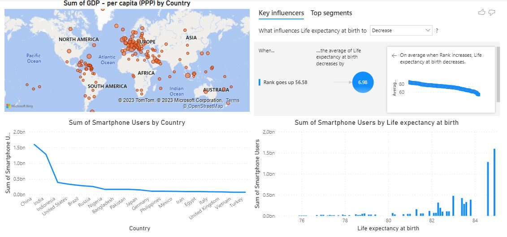

This report is aim to study the country wealth (GDP), life expected and smartphone users around world.

The data source comes from the public source for study purpose.
I used this data only to demonstrate / practice my dashboard presentation skills, If you are interested reviewing and testing the project please use my Google CoLab notebook  [Google CoLab notebook](https://colab.research.google.com/drive/1FhjdinLX9dejz4spkXrhXDHuENXQM3Fq#updateTitle=true&folderId=1Q9EqShSEW9F3ULWA9Z6sSSbFlLBSQTmO)or download the **data file** ["data"](../GDP_Country/The Wealth of nations-GDP.xlsx)

then imported into the **power bi** or **tableau** to analyze it. 

If you are interested reviewing and testing the project please use my Google CoLab notebook

[Click here to return to the main page](../README.md)

