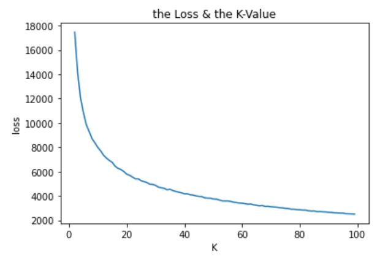

## My-data-analyst-portfolio
I am a keen data analyst with experience of working on a number of the different projects. As part of my work with these projects I was able to collect, organize and explore the data in order to find and provide business insight, for example, in Project**HollywoodsMostProfitableStories** I was able to collect,clean the data using **RStudio** and **Power BI** to visualize the data; and in project**subsurface facture classification** I use the real data collected from the field survey and use the machine learning (**ML**) **KMean method** to analyze it. The result have been used into the engineering survey project.

I am proficient in **Python, R, SQL,my SQL,Tableau, AZure,Power Bi**

I have experience in designing and creating dashboards in main industry sectors, reported to clients and help company to make business decision.

I am confident in my data analytics skills and that my experience, attitude and communication skills would make me an ideal candidate for a data analyst role.

For details on each of the project please review the linked documents.

**Projects:**  
* [HollywoodsMostProfitableStories](holly/readme.md)
This is a data analysis case for filming markets
      

* [Employment data study](emsi/readme.md)
This is a data analysis case for Employment Data in UK
    

* [Python.numpy/pandas/mapplot case](python/mapplot/readme.md)
This is a case study for practise the numpy/pandas/mapplot skills
        

* [Python.ML.TITANIC_case](python/readme1.md)
This is a case study to train the Titanic surviving data for Machine learning(ML)
        

* [Python.Kmean.Subsurface facture classification](python/readme2.md)
This is a facture engingering project used into facture monitor processing. The data collected by myself using 24 geophones in a field for 15 days. There are huge database and upto 19 factors affecting the result. I use the **KMean ML method** to solve this data processing problem. The more detail introducation can be found in linked project.
          

* [Python.ML.(7 models) predict cancer classifcation](python/readme3.md)
This is a cancer case study to classify the factors which result into the cancer prediction. The 7 methods used to build model and result show 92-97% accurcy:
* The models include
* **KNeighborsClassifier,**
* **DecisionTreeClassifier,**
* **MLPClassifier,**
* **RandomForestClassifier,**
* **AdaBoostClassifier and BaggingClassifier** to solve this case study.
* The more detail introducation can be found in linked project.
          
  
If you are interested in reviewing and testing the project please use my [Google CoLab notebook](https://colab.research.google.com/drive/1FhjdinLX9dejz4spkXrhXDHuENXQM3Fq#updateTitle=true&folderId=1Q9EqShSEW9F3ULWA9Z6sSSbFlLBSQTmO)

* [Click here to return to the main page](README.md)

