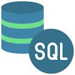

## My-data-analyst-portfolio
I am a keen data analyst with experience of working on a number of different projects. As part of my work with these projects I was able to collect, organize and explore the data in order to find and provide business insight; for example, in project**HollywoodsMostProfitableStories** I was able to collect,clean the data using **RStudio** and **Power BI** to visualize the data.

I am skillfully use **Python, R, SQL,my SQL,Tableau, AZure,Power Bi**

I have experience in designing and creating dashboards in main industry sects, reported to clients and help company make business decision.

I am confident in my data analytics skills and that my experience, attitude and communication skills would make me an ideal candidate for a data analyst role.

For details on each of the project please review the linked documents

**Projects:**  
* [HollywoodsMostProfitableStories](holly/readme.md)
This is a data anylsis case for film markets
      

* [employment data study](emsi/Readme.md)

If you are interested reviewing and testing the project please use my [Google CoLab notebook](https://colab.research.google.com/drive/1qliHpWa2ZjJMls7ii0N8p5Ki8cs9neK-?usp=sharing)

[Click here to return to the main page](../README.md)

