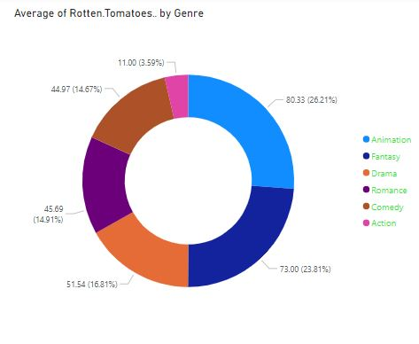

This project explores the films made during 2007-2011 by hollywood, to analysis the market value distribution for each film

The project starts by cleaning the data collected through **public source** using **RStudio**:
```
  #Load data
df<- read.csv("https://public.tableau.com/app/sample-data/HollywoodsMostProfitableStories.csv")
#Take a look at the data: 
View(df)

```
then imported into the power bi to analyze it 



If you are interested reviewing and testing the project please use my Google CoLab notebook

Click here to return to the main page
