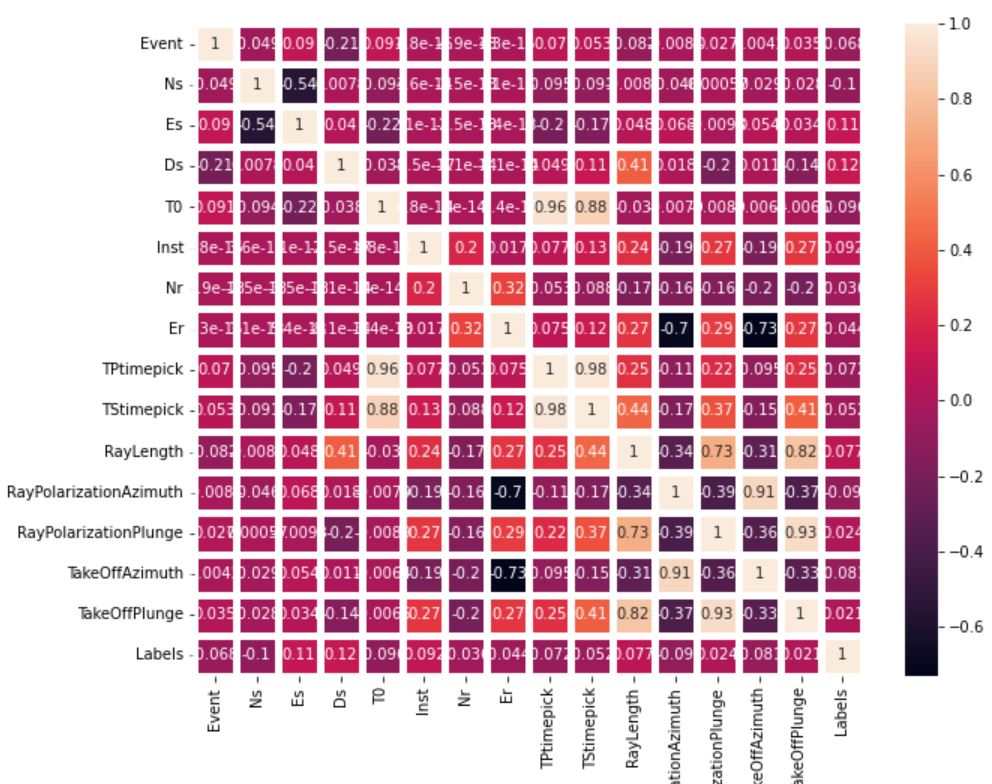

This is a very challenge real project in engineer survey. The aim is to find a processing method to anylze fracture monitor data which is **19 dimensional data** and continuing recored during 15 days.

The key steps are **cleaning data, reducing dimensions,normalize different factors,ML learning modell build up,to study K=? in KMean method, and classified code refilled into the factures** 
  
Key code
```
import numpy as np
import pandas as pd
import matplotlib.pyplot as plt
from sklearn.preprocessing import StandardScaler
from sklearn.model_selection import train_test_split

# normalize data
SD = StandardScaler()
new_data_SD = SD.fit_transform(new_data)
new_data_SD

# KMean method classification analysis
from sklearn.cluster import KMeans

loss = []
for i in range(2,100):
    model = KMeans(n_clusters=i).fit(new_data_SD)
    loss.append(model.inertia_)

plt.plot(range(2,100),loss)
plt.xlabel('K')
plt.ylabel('loss')
plt.title('the Loss & the K-Value')
plt.show()

#after study to check K=30
K=30
model = KMeans(n_clusters=K).fit(new_data_SD)
# write the classification result into the data
labels =[]
labels=model.labels_

#print out the result
for i in range(K):
    print('frcture distribution cluster:',i)
    name = new_data[new_data['Labels']==i].iloc[:,0] # write a classification type into a data 
    print(name.values)
```
  <br>      <br>    
  The above result of **K&loss** is very help to find the best parameters **K, the classification number of natural fracture when the hydro-fracture engineering work which generate the fractures** 
  
If you are interested reviewing and studying this project please contact with me for my data permition, and
use my [**Google CoLab notebook**](https://colab.research.google.com/drive/1FhjdinLX9dejz4spkXrhXDHuENXQM3Fq#updateTitle=true&folderId=1Q9EqShSEW9F3ULWA9Z6sSSbFlLBSQTmO)

[Click here to return to the main page](../README.md)

