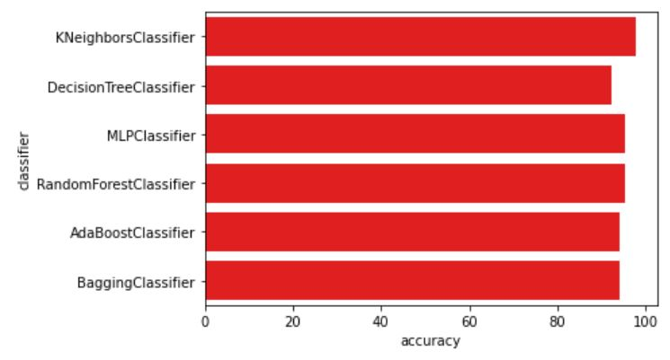
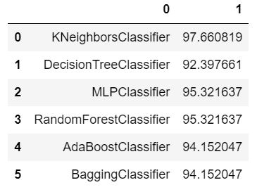

This is a PCA reducing demensional and modelling case with using published data in **Numpy database**

* <p>The database is a big data include 64 colums (factors) to be consider, so key studysteps are cleaning data, reducing dimensions,different (ML) learning models building up,classified groups into 3 dimensional.
<br>
Key code:

```
import pandas as pd
import numpy as np
import matplotlib.pyplot as plt

#normalize the data
from sklearn.preprocessing import StandardScaler

SS = StandardScaler()
x_data = SS.fit_transform(x_data)
x_data.shape

#7 models
from sklearn.metrics import classification_report,accuracy_score
from sklearn.neural_network import MLPClassifier
from sklearn.tree import DecisionTreeClassifier
from sklearn.neighbors import KNeighborsClassifier
from sklearn.linear_model import LinearRegression
from sklearn.ensemble import RandomForestClassifier,AdaBoostClassifier,BaggingClassifier

classifiers = [
    KNeighborsClassifier(3),
    DecisionTreeClassifier(max_depth=9,min_samples_split=5,min_samples_leaf=3),
    #LinearRegression(),
    MLPClassifier(hidden_layer_sizes=(20,50),max_iter=10000),
    RandomForestClassifier(max_depth=9,min_samples_leaf=3),
    AdaBoostClassifier(),
    BaggingClassifier(),
              ]

log =[]

for clf in classifiers:
    clf.fit(x_train,y_train)
    name = clf.__class__.__name__
    
    print('*'*30)
    print(name)
    
    print("--------------result---------------")
    predictions = clf.predict(x_test)
    acc = accuracy_score(y_test,predictions)
    
    print(acc)
    log.append([name,acc*100])

```

 <br>      <br>    
 
If you are interested reviewing and studying this project please contact with me for my data permition, and
use my [**Google CoLab notebook**](https://colab.research.google.com/drive/1FhjdinLX9dejz4spkXrhXDHuENXQM3Fq#updateTitle=true&folderId=1Q9EqShSEW9F3ULWA9Z6sSSbFlLBSQTmO)

[Click here to return to the main page](../README.md)


