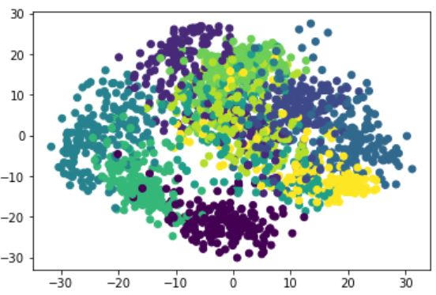
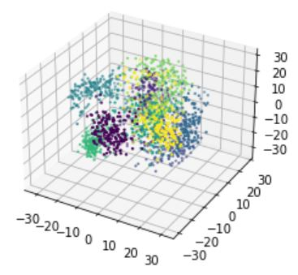

This is a PCA reducing demensional and modelling case with using published data in **Numpy database**

* <p>The database is a big data include 64 colums (factors) to be consider, so key studysteps are cleaning data, reducing dimensions,different (ML) learning models building up,classified groups into 3 dimensional.
<br>
Key code:

```
from sklearn.datasets import load_digits
import numpy as np
import pandas as pd
from sklearn.neural_network import MLPClassifier
import matplotlib.pyplot as plt

digits = load_digits()
x_data = digits.data
y_data = digits.target

from sklearn.model_selection import train_test_split
x_train,x_test,y_train,y_test = train_test_split(x_data,y_data,test_size=0.3)

nml = MLPClassifier(hidden_layer_sizes=(20,40),max_iter=500)
model = nml.fit(x_train,y_train)

predictions = model.predict(x_test)
from sklearn.metrics import classification_report,confusion_matrix
print(classification_report(predictions,y_test))
print(confusion_matrix(predictions,y_test))

def zeromean(dataMat):
    meanVEL = np.mean(dataMat,axis=0)
    newdata = dataMat-meanVEL
    return newdata, meanVEL

def pca(dataMat,top):
    newdata,meanVEL = zeromean(dataMat)
    covMat = np.cov(newdata,rowvar=0)
    eigVals,eigVects = np.linalg.eig(np.mat(covMat))
    eigValsIdicates = np.argsort(eigVals)
    n_eigValsIdicates = eigValsIdicates[-1:-(top+1):-1]
    n_eigVect = eigVects[:,n_eigValsIdicates]
    lownewdata = newdata*n_eigVect
    recondata = (lownewdata*n_eigVect.T)+meanVEL
    return lownewdata,recondata

lownewdata, recondata = pca(x_data,2)
x = np.array(lownewdata)[:,0]
y = np.array(lownewdata)[:,1]
plt.scatter(x,y,c=y_data)
plt.show()

from mpl_toolkits.mplot3d import Axes3D
x = np.array(lownewdata)[:,0]
y = np.array(lownewdata)[:,1]
z = np.array(lownewdata)[:,2]

ax = plt.figure().add_subplot(111,projection='3d')
ax.scatter(x,y,z,c=y_data,s=2)
plt.show()
```
The result is very good and the big data can be seperated into different classified group in 3D scatter map.

 <br>      <br>    
 
If you are interested reviewing and studying this project please contact with me for my data permition, and
use my [**Google CoLab notebook**](https://colab.research.google.com/drive/1FhjdinLX9dejz4spkXrhXDHuENXQM3Fq#updateTitle=true&folderId=1Q9EqShSEW9F3ULWA9Z6sSSbFlLBSQTmO)

[Click here to return to the main page](../README.md)


