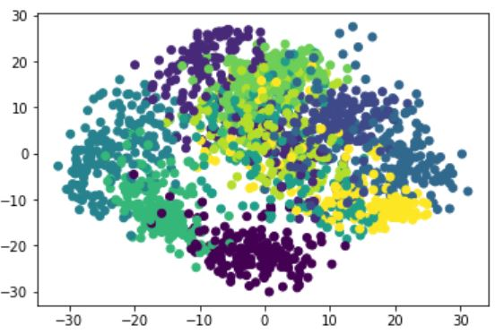
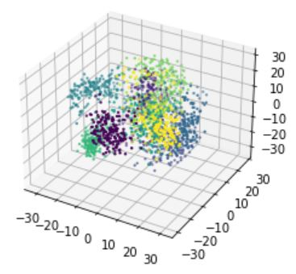

This is a fluit classiy case to be used into farm (AI intellegent to classify the fluits). I studied and modelling the training data,built a **KNN model** and classified it using **K_Neighbors_Classifier** method.
* **K-NN Varying the number of neighbors** to justify the right **K**.
* **Mplot3d**
  to solve this problem.

* <p>The database is a big data include 64 colums (factors) to be consider, so key studysteps are cleaning data, reducing dimensions,different (ML) learning models building up,classified groups into 3 dimensional.
<br>
Key code:

```
from sklearn.datasets import load_digits
import numpy as np
import pandas as pd
from sklearn.neural_network import MLPClassifier
import matplotlib.pyplot as plt

digits = load_digits()
x_data = digits.data
y_data = digits.target

from sklearn.model_selection import train_test_split
x_train,x_test,y_train,y_test = train_test_split(x_data,y_data,test_size=0.3)

nml = MLPClassifier(hidden_layer_sizes=(20,40),max_iter=500)
model = nml.fit(x_train,y_train)

```

The result is very good and the big data can be seperated into different classified group in 3D scatter map.

 <br>      <br>    
 
If you are interested reviewing and studying this project please contact with me for my data permition, and
use my [**Google CoLab notebook**](https://colab.research.google.com/drive/1FhjdinLX9dejz4spkXrhXDHuENXQM3Fq#updateTitle=true&folderId=1Q9EqShSEW9F3ULWA9Z6sSSbFlLBSQTmO)

[Click here to return to the main page](../README.md)


