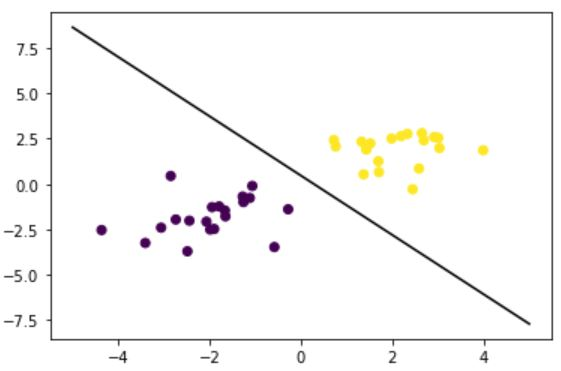

This is a case study for training the linear classified model for spceil dataabase. I generate the random datbase and bluiding the linear classified model for training and predict data.

* The database is generated by **Numpy.random**,and the key steps are to familir the **SKlearn. SVM** to training the data.
<br>
Key code:

```
import numpy as np
import matplotlib.pyplot as plt
from sklearn import svm

x_data = np.r_[np.random.randn(20,2)-[2,2],np.random.randn(20,2)+[2,2]]
y_data =[0]*20+[1]*20
print(x_data.shape)
print(y_data)
plt.scatter(x_data[:,0],x_data[:,1],c=y_data)
plt.show()

model = svm.SVC(kernel='linear') 
model.fit(x_data,y_data)

plt.scatter(x_data[:,0],x_data[:,1],c=y_data)

x_test=np.array([[-5],[5]])
b=-model.intercept_/model.coef_[0][1]
k= -model.coef_[0][0]/model.coef_[0][1]
y_test = x_test*k+b

plt.plot(x_test,y_test,c='k')
plt.show()
```

The result is very good and the big data can be seperated into different classified group in 3D scatter map.

 <br>     
 
If you are interested reviewing and studying this project please contact with me for my data permition, and
use my [**Google CoLab notebook**](https://colab.research.google.com/drive/1FhjdinLX9dejz4spkXrhXDHuENXQM3Fq#updateTitle=true&folderId=1Q9EqShSEW9F3ULWA9Z6sSSbFlLBSQTmO)

[Click here to return to the main page](../README.md)
