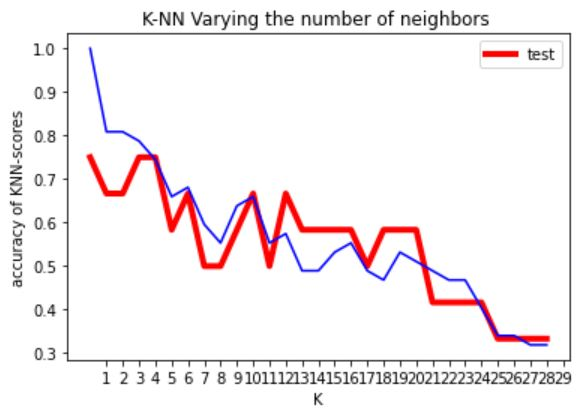
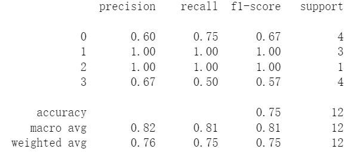

This is a fluit classiy case to be used into farm (AI intellegent to classify the fluits). I studied and modelling the training data,built a **KNN model** and classified it using **K_Neighbors_Classifier** method.
* **K-NN Varying the number of neighbors** to justify the right **K**.
* **Mplot3d**
  to solve this problem.

* The database is a published data include 5 colums (factors) to be consider, so key steps are cleaning data, (ML) learning models building up,justify the proper **K** value and classified groups.
<br>
Key code:

```
from sklearn.neighbors import KNeighborsClassifier
import numpy as np
import pandas as pd
from sklearn.model_selection import train_test_split
from sklearn.metrics import classification_report 
from sklearn.preprocessing import LabelEncoder
import matplotlib.pyplot as plt
k = np.argmax(test_scores)+1
print(k)
knn = KNeighborsClassifier(n_neighbors=k)
knn.fit(x_train,y_train)

print(knn.score(x_test,y_test))
print(classification_report(y_test,knn.predict(x_test)))

```

The result is very good and the big data can be seperated into different classified group in 3D scatter map.

 <br>      <br>    
 
If you are interested reviewing and studying this project please contact with me for my data permition, and
use my [**Google CoLab notebook**](https://colab.research.google.com/drive/1FhjdinLX9dejz4spkXrhXDHuENXQM3Fq#updateTitle=true&folderId=1Q9EqShSEW9F3ULWA9Z6sSSbFlLBSQTmO)

[Click here to return to the main page](../README.md)
